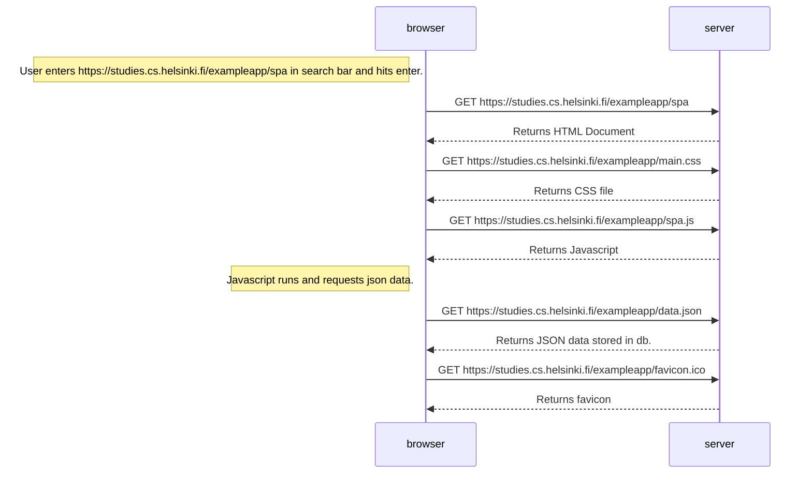

```mermaid
sequenceDiagram
    participant browser
    participant server

    Note left of browser: User enters https://studies.cs.helsinki.fi/exampleapp/spa in search bar and hits enter.

    browser->>server: GET https://studies.cs.helsinki.fi/exampleapp/spa
    server-->>browser: Returns HTML Document
    
    browser->>server: GET https://studies.cs.helsinki.fi/exampleapp/main.css
    server-->>browser: Returns CSS file
    
    browser->>server: GET https://studies.cs.helsinki.fi/exampleapp/spa.js
    server-->>browser: Returns Javascript
    
    Note left of browser: Javascript runs and requests json data.
    
    browser->>server: GET https://studies.cs.helsinki.fi/exampleapp/data.json
    server-->>browser: Returns JSON data stored in db.

    browser->>server: GET https://studies.cs.helsinki.fi/exampleapp/favicon.ico
    server-->>browser: Returns favicon
  
```