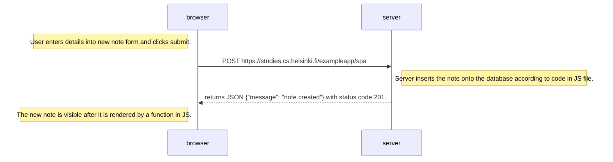

```mermaid
sequenceDiagram
    participant browser
    participant server

    Note left of browser: User enters details into new note form and clicks submit.

    browser->>server: POST https://studies.cs.helsinki.fi/exampleapp/spa

    Note right of server: Server inserts the note onto the database according to code in JS file.
    
    server-->>browser: returns JSON {"message": "note created"} with status code 201.
    
    Note left of browser: The new note is visible after it is rendered by a function in JS.
```